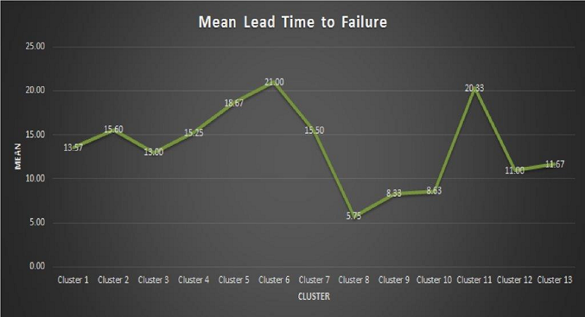
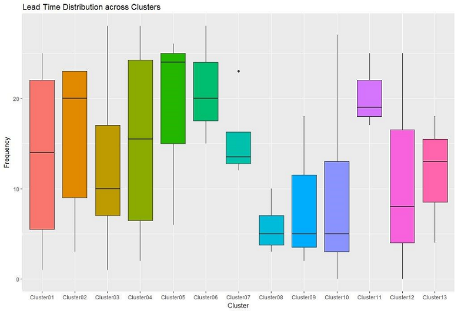

#### Machine Identification:
This tab displays the most frequent error sequence, which describes the path followed by machines leading to the failure stage, separately for all clusters. There are 13 clusters with their respective error sequence describing the errors machine generate before failing down.

__Instructions__

* First select the cluster from dropdown box.
* Select the DTC code.
* Click on the Machine Identification collapse panel.

This panel informs the population of machines currently have generated that error code and how much lead time does we have to take preventive actions to prevent machine from reaching to the next error stage or failing down. Machine identification number is also available for immediate preventive action and prioritization.

#### Clusters wise Mean Lead time to Failure:
This panel displays the plot of mean lead time to failure of the machines across clusters. The mean lead time describes how much time on average we have to take preventive actions to prevent machine from failing down. More elaborative view of the time taken historically across machines and across clusters is displayed in the Summary Box Plot panel below.

#### Summary Box plot:
This panel shows the time distribution plot providing the cluster wise view of how much time machines, historically, have taken before reaching to the failure stage.

__Example__ - For cluster 8, the median is present at 5 days which means 50% of the machines in that cluster fails within 5 days of time after the first error code get generated.

