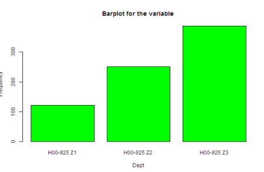
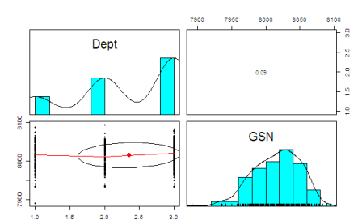

__Exploratory data analysis__ tells us about the descriptive statistics of the dataset. In this tab we have analyzed the characteristics of the dataset. There are three type of analysis which are presented in it -

#### Univariate Analysis

Univariate analysis is the simplest form of analyzing data. 

__Instructions:__

1. Select the Exploratory data analysis tab. 
2. Select Univariate Analysis
3. Select the dataset from the "Select the dataset" menu
4. Select a variable to be analyzed.

__Example:__ Below is the barplot (frequency distribution) of the "Dept" variable of the warranty data set.

#### Bivariate Analysis

Bivariate analysis is the simultaneous analysis of two variables (attributes). It explores the concept of relationship between two variables, whether there exists an association and the strength of this association, or whether there are differences between two variables and the significance of these differences.

A bivariate plot graphs the relationship between two variables that have been measured on a single sample of subjects. Such a plot permits you to see at a glance the degree and pattern of relation between the two variables.

__Instructions:__

1. Select the Exploratory data analysis tab. 
2. Select Bivariate Analysis
3. Select the dataset from the "Select the dataset" menu
4. Select the variables to be analyzed.
  
To generalize the type of plot being used, the following scheme is used:

__Numerical vs Numerical Variable__
* An XY scatter plot is used to represent these two variable.

__Numerical vs Categorical variable__
* A box plot is used to plot these type of variables. 

__Categorical vs Categorical variable__
* A bar plot representing the frequency of occurrence of one variable with respect to the other
Variable is used to plot these type of variable.

__Example:__Image shows a boxplot of GSN against the Date of Change. The Line inside the box represents the mean value, the points outside represent the outliers . 

#### Distribution Graph
A scatter plot matrix is drawn in this tab for the selected variable. The lower off diagonal of the plot draws scatter plots, the diagonal histograms while the upper off diagonal of the plot reports the Pearson correlation value.

__Instructions:__

1. Select the Exploratory data analysis tab. 
2. Select Distribution graphs Analysis
3. Select the dataset from the "Select the dataset" menu
4. Select all the variables for which one need a plot. 

__Note:__ One need to select atleast two variables. Also one can not select a variable which is having only one unique value.

__Example:__ In the above plot distribution of the variables is shown on the principle diagonal. The upper off diagonal displays the corelation value of 0.09 among the variables.

