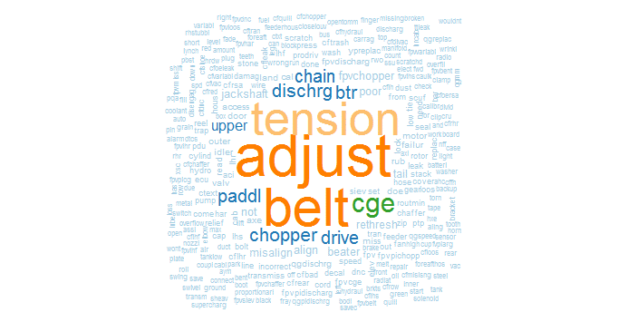

## Warranty Clustering

The datasets have information about auto-mobile defects and service centre compliant information details. Model is build based on the description of the defect. We have used the topic modelling with __LDA Algorithm__. By using the topic modelling we have divide the data into 13 clusters.

#### Technical Details

__WordCloud:__ It is a text mining method that allows us to highlight the most frequently used keywords in a paragraph of texts. Here we are showing the most used keywords which are present in the Description column of the file. 

__Word Cloud__ helps us in presenting the most frequent causes of the warranty claims in a simple and visually engaging manner. Based on the above Word Cloud the most common defect is related to tension and belt adjustment.

__LDA & Topic Modelling:__ Clustering methods can be used to automatically group the causes of the warranty claims into a list of meaningful categories. LDA is a probabilistic topic model capable of inferring a topic distribution based on word content for each document (in this case description of warranty claims) in a collection. In it we leverage statistical machine learning techniques including encoding raw text into a form consumable by clustering algorithms and then retrieve the important topics that are hidden in the data. After that each description is clubbed in to one of the formed topics on the basis of its association with that topic. The below table represents the 13 topics and their distribution over the description variable.

## DTC Sequencing

* __Product level DTC__ data set has been used to predict most frequent DTC sequences followed at machine level.

* Most frequent DTC sequences are predicted using __CSPade-Sequence__ mining prediction algorithm. 

* Sequences with higher support and which ended with Major/Critical/Down issue have been selected for calculating the average lead time across all products
