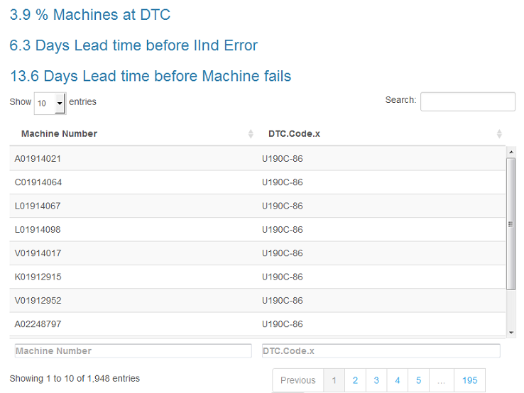

#### Replacement Rate 

Replacement Rate gives the rate at which replacements have been done for the different parts across topics. The replacement rate is calculated as below :
* Replacement Rate for a Part = Number of Replacements of the part/Number of claims for the part

#### Warranty Hours

The plot for warranty hours provides the average warranty hours and standard deviation of the warranty hours across the topics.
* The typical warranty hours at time of replacement for parts inside topics gives an visual understanding of when the machine can be expected to fail. 

#### Reliability curves 

The reliability curves provide the topic-wise distribution of warranty claims. It measures the reliability of the machine at various time periods.
* The reliability of the machine follows a Weibull distribution. The reliability at any given point can be viewed by hovering above the point of the curve for a time period.

#### Average Machine Lead Time to Failure

The line graph shows the average lead time before machines reaches to its down stage or critical stage for all clusters.

#### Distribution of Time to Failure 

Graph presents the distribution of time taken across all machines across all clusters. 

#### Machine Identification

Lead time represents how much time does we have to take preventive actions before machine reaches to the second error and there from to the failure stage.

